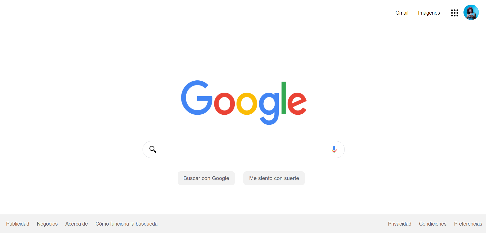

# Clonación de la Interfaz de Google con HTML y CSS

Hola, ha llegado el momento de poner en práctica lo aprendido y para ello te pido que puedas clonar la interfaz de Google siguiendo los diguientes pasos:

## **ÍNDICE**

* [1. Intro](https://github.com/nancynsalazar/clonacion-google/blob/main/README.md#1-intro)
* [2. Demo](https://github.com/nancynsalazar/clonacion-google/blob/main/README.md#2-demo)
* [3. ¿Qué construirás?](https://github.com/nancynsalazar/clonacion-google#3-qu%C3%A9-construir%C3%A1s)
* [4. Objetivos de Aprendizaje](https://github.com/nancynsalazar/clonacion-google#4-objetivos-de-aprendizaje)
* [5. Requisitos](https://github.com/nancynsalazar/clonacion-google#5-requisitos)

****

## 1. Intro

HTML trabaja de la mano con CSS para crear las páginas web que usamos todos los días en el navegador💻. Incluso, este sitio web en donde estás viendo este contenido está construido con HTML y CSS🤯 (junto con otros elementos que conocerás más adelante). Para este primer proyecto, con los conocimientos que tienes de HTML y CSS realizarás la clonación de la interfaz de Google, sí, esa que ves cada que haces una búsqueda en su navegador, ¿aceptas el reto🤓?
****

## 2. Demo

Puedes entrar a ver el demo en este vínculo: https://dazzling-nightingale-01ce86.netlify.app

La idea es inspirarte con esta demostración de proyecto. 

**¡Quizá no te quede idéntico o quizá te quede mucho mejor que este demo🤩**, utiliza tu destreza y aprendizaje para que demuestres que tu futuro es ser un(a) programador(a) web.👩🏻💻👦🏻

****

## 3. ¿Qué construirás?

Este proyecto está enfocado en construir la interfaz estática de Google.

Se te pide que sea una sola página que contenga las secciones siguientes:
  - **a. Header**
    Sección que involucra la foto del perfil, iconos, logo de Google y las áreas principales del sitio.
  - **b. Main**
    Sección del contenedor para los elementos centrales de la página. 
  - **c. Footer**
    Sección que incluye hipervínculos al final de la página.

****

## 4. Objetivos de aprendizaje

El objetivo principal de este proyecto es desarrollar una interfaz utilizando HTML y CSS, en toda su aplicación.

Aplicarás:

- Etiquetas estándar HTML5.
- Estilos con CSS

****

## 5. Requisitos

Usa esta lista para saber los requisitos mínimos del proyecto:

### GENERAL

Realizarse de manera individual

### UI
- [ ] Aplicar en todo el sitio HTML semántico de estándar no.5 (HTML5).
- [ ] Aplicar tipos de selectores en CSS.
- [ ] Sección `Header`, `main`, `footer`

Happy coding!❤

